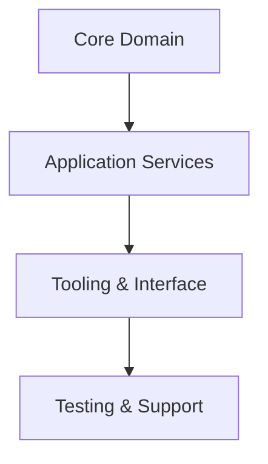

# Architecture Specification

> Generated by openlore v1.0.0 on 2026-06-07 07:57

## Purpose

This document describes the architectural patterns and structure of the system.

## Architecture Style

Event-driven, modular architecture. The system is composed of distinct libraries (modules) that
operate on a stream of events representing changes to project data. This decouples components and
allows for flexible processing and state reconstruction, suitable for a system managing evolving
project information.

## Requirements

### Requirement: LayeredArchitecture

The system SHALL maintain separation between:
- Core Domain (Defines the fundamental data structures and concepts of the system.)
- Application Services (Contains the core business logic and orchestrates interactions with external AI models.)
- Tooling & Interface (Provides command-line interfaces or entry points for users to interact with the system's capabilities. The high fan-in of `run_binary` in tests suggests a primary CLI entry point.)
- Testing & Support (A significant layer dedicated to ensuring correctness through behavioral and unit tests, with extensive test fixtures and setup utilities.)

#### Scenario: LayerSeparation
- **GIVEN** a request from the presentation layer
- **WHEN** business logic is needed
- **THEN** the presentation layer delegates to the business layer
- **AND** direct database access from presentation is prohibited

### Requirement: SecurityModel

The system SHALL implement security via: Not applicable. The analysis indicates the system is a set of local libraries and command-line tools. There is no evidence of network-exposed APIs, user accounts, or an authentication/authorization model.

#### Scenario: AuthenticatedAccess
- **GIVEN** an unauthenticated request
- **WHEN** accessing protected resources
- **THEN** access is denied

## System Diagram

## Layer Structure

### Core Domain

**Purpose**: Defines the fundamental data structures and concepts of the system.
**Location**: `project_schema, ExtractedItem (Entity), event definitions, ontology models`

### Application Services

**Purpose**: Contains the core business logic and orchestrates interactions with external AI models.
**Location**: `ItemExtractorService, OntologySuggester`

### Tooling & Interface

**Purpose**: Provides command-line interfaces or entry points for users to interact with the system's capabilities. The high fan-in of `run_binary` in tests suggests a primary CLI entry point.
**Location**: `CLI binary (inferred), Public library functions (e.g., `suggest_proposals`)`

### Testing & Support

**Purpose**: A significant layer dedicated to ensuring correctness through behavioral and unit tests, with extensive test fixtures and setup utilities.
**Location**: `test_support, behavioral tests`

## Data Flow

Unstructured text and a project schema are provided to the ItemExtractorService. The service calls
an external AI model to parse the text, producing structured ExtractedItem data. This data is likely
transformed into a series of events which are persisted to a file-based log. Other components, like
the OntologySuggester or reporting tools, read this event stream to build their state and perform
their functions.

## External Integrations

| System | Purpose |
|--------|---------|
| Google Gemini | External AI model used by the ItemExtractorService to parse unstructured text into structured data. |
| Generative AI Service | External AI model used by the OntologySuggester to generate proposals for schema modifications. |
| File System | Inferred from test setup functions like `setup_temp_dir` and `read_is_events` for persisting event logs and project state. |
